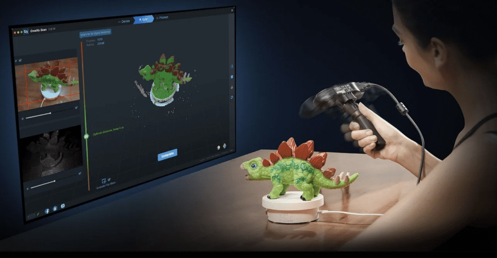

# Tutorials on CR-Scan Ferret



# Introduction

CR-Scan Ferret is a compact consumer-grade 3D scanner that offers high precision with a maximum accuracy of 0.1mm. It is small in size and lightweight, making it easy to carry. The scanner is cross-platform compatible and can work on multiple platforms such as Windows, Mac, and Android (CR-Scan Ferret Pro is compatible with iOS).

To help new users quickly master the scanner’s operation techniques and achieve better scan quality, this tutorial provides scan advice and tips for different types of objects, including cars, motorcycles, human bodies, faces, shoes, headphones, and so on. It covers software configuration recommendations and various scanning techniques that can be applied in practical scanning scenarios.

# Scanning Configuration

In the Creality Scan software, multiple scanning modes are provided. It is important to choose the appropriate scanning mode for different types of targets.

```
<p align="center">
  
</p>
```

**How to choose Feature type?**

(1) **Geometry**: For objects with rich geometric features, it is recommended to use the Geometry Mode for scanning.

(2) **Texture**: For small objects with limited geometric features, it is suggested to apply the Texture Mode after placing marker points. For very small objects, the marker points can be placed on the table. For objects with rich texture but limited geometric features, the Texture Mode can be directly used for scanning.

(3) **Marker**: For large objects where reliable accuracy is desired, it is recommended to use the Marker Mode for scanning. This mode requires **circular marker points** to be attached to the surface of the object. For large objects, marker points with an inner diameter of 6mm should be used, while for small objects, marker points with an inner diameter of 3mm can be used.

How to determine if an object has rich geometric features?

Objects that have standard geometric shapes, such as cubes or cylinders, or objects with large flat surfaces that lack distinct geometric features, do not have rich geometric features. Common objects like cylindrical mugs, square-shaped boxes, or truck cargo compartments do not have rich geometric features.

On the other hand, objects like portrait sculptures, shoes, or doll models have rich geometric features.

**Accuracy**

If you want to obtain better details, do not hesitate to choose “Hi-Quality”. If your computer has a dedicated graphics card (i.e. GPU), the Hi-Quality mode will provide smoother performance.

For large objects or lower computer specifications, you can choose "Fast Mode“ for scanning.

**Turntable**

Regarding the Turntable option, if you select "Yes", the point clouds on the turntable plane will be removed during the tracking process.

# Basic Terms and Concepts

### **Scanning distance**

The accuracy of all scanners is related to the scanning distance. Generally, the closer the scanner is to the target while still obtaining point clouds, the higher the accuracy. The Ferret scanner has a minimum working distance of 15cm and can reach a maximum distance of 70cm. For scanning smaller objects, the scanner should be positioned close enough to the target to ensure reliable tracking without losing accuracy.

Follow the instructions provided by the scanning software to maintain the "Optimal Distance".

### **Exposure time**

Creality Scan offers two camera exposure control modes: automatic exposure and manual exposure.

For larger targets, such as faces, Auto-Exposure can be used for scanning.

For smaller objects, automatic exposure may not be accurate. It is recommended to manually adjust the exposure time of the IR camera.

[Tutorial on Exposure Adjustment](https://youtu.be/ivGwDYuXclc?list=PL6oK7YUSEc48zhw6Lj8JTTIsij62TGEoE)

### **Quality colormap**

During the scanning process, Creality Scan provides a quality colormap for point clouds to indicate whether the current scan quality is high enough. The following image is an example of determining scan completeness based on the quality colormap of point clouds. The object on the left shows a mix of red and green, indicating a relatively poor quality of the scanned point cloud, while the object on the right appears uniformly green, indicating a relatively good quality of the scanned point cloud.


### **Pointcloud optimization**


After the scanning process, it is necessary to perform pointcloud optimization to fuse the scanned multiple frames of point clouds (several hundred or even thousand frames) and obtain a higher quality pointcloud. 

Resolution is one of the important parameters for this process. A smaller resolution setting will capture more details in the model but may require longer processing time. However, setting the resolution too small, such as 0.15mm, may result in missing parts of the model.

When dealing with smaller objects, such as those below 30cm, or when seeking better details, it is recommended to set the resolution to 0.3mm or 0.25mm.

Sensitivity: The larger this value, the more points can be retained. The smaller the value, the more points will be filtered out. 

Creality Scan software allows users to perform pointcloud optimization multiple times. For instance, if you are not satisfied with the current optimization results, you can modify the parameters and re-run the pointcloud optimization step.

### **One-click Process**

One-click processing is designed for new users who have little experience with 3D scanners. If you require better scan quality, it is recommended not to use One-click Processing and instead manually adjust the parameters for each processing step.

### **Model editing**

Creality Scan provides pointcloud editing functionality. After the point cloud optimization is complete, users can select and delete unwanted points in the point cloud.


### **Meshing**

The meshing operation converts pointcloud data into a triangular mesh model.


During the process of meshing, you can manually configure the number of faces of the generated mesh, adjust the level of smoothness of the mesh, and choose whether to fill holes and close the model.

The more faces in the mesh, the finer the model, but it also takes longer to generate the mesh.


### **Texturing**

The Ferret scanner is equipped with a high-definition RGB camera, allowing for the capture of true-color textures for 3D models.


### **Import Hitorical Project**

When scanning with a PC, if you don't have time to wait for the post-processing to complete, you can click "Complete" and use the "Import Historical Project" feature in the future to import the scan project file into the software for further processing.

Mobile scanning, PC processing

Ferret supports mobile scanning, which offers great portability. Many Android phones have only 8GB of memory, and the iPhone 12 has only 4GB of memory, while many computers have 16GB of memory. You can choose to scan with your mobile phone first. After completing the scan on your phone, save the model, return to the main interface, then export the project. Later, on your PC, use the "Import Historical Project" feature to import the scanned project file and process it on the computer, thus obtaining a higher-quality 3D model.


### **Multi-project Merging**

Each scan can capture only a portion of the object, and then you can use the Multi-Project Merging feature to combine them into a complete model. This is extremely helpful for scanning larger objects.


How to scan the bottom of an object?

When you need to scan the bottom of an object, you can place the object on a tabletop and scan the visible parts first. Then, create a new project and position the object on its side or upside-down for another scan. Use the Multi-Project Merging feature to merge these two sets of pointclouds together, creating a complete 3D model of the object. During both scans, make sure that there are sufficient overlapping areas being captured. 

After completing the first scan and performing pointcloud optimization, you can start a new scan by selecting "New Project." On the page for Multi-Project Merging, you can automatically or manually merge the fused point clouds. Below is an example of manual multi-project merging.


# Scanning Cases

## Human face

For the CR-Scan Ferret, the human face is one of the easiest targets to scan. For users who are using a 3D scanner for the first time, it is recommended to start with scanning the face.

*Recommended scan setting: Face | Geometry | Hi-Quality | Color.*

If you want to obtain a more detailed mesh model, during the pointcloud optimization step, we recommend manually setting the pointcloud resolution to a smaller value, such as 0.3mm. If you want a smoother mesh model, you can set the resolution to a larger value, such as 0.5mm.

**Precautions for scanning faces**

(1) The person being scanned should try to remain still and keep their expression unchanged until the scanning is complete.

(2) It is safe to keep the eyes open during the Ferret scanning process.

(3) Avoid wearing glasses during the scan.

(4) Loose and fluffy hair is more difficult to scan, so during the scan, one can choose to wear a hat, apply dry shampoo for better tracking, or tie the hair up for female subjects.

Below is an example of scanning Nana's face using the Ferret scanner.


## Full body

*Recommended scanning setting: Body | Geometry | Fast | Color.*

**Note on scanning human body**

(1) During the scanning process, the person being scanned and their clothing should remain as still as possible until the scanning is complete.

(2) It is recommended to start scanning from the front face, scanning in the order of the head, chest, waist, and legs, from top to bottom.

(3) If someone can stand on a turntable, it can result in better scanning results.

Below is an example of Nana's body scan.


How long does it take to scan the full body?

If you are familiar with the operation of the scanner, you can complete a full body scan within 3 minutes (i7 cpu, Nvidia 1060 GPU). The time here refers to scanning time, not processing time.

## Large objects

**Car bumper**

It is recommended to use the Marker Mode for scanning. In the case below, approximately 150 circular marker points with an inner diameter of 6mm were placed on the front of the vehicle. 

Note that transparent headlights, if not powder sprayed, will cause hollow holes in the generated 3D model at this area.


***Scan settting：**Large Object, Marker Mode, Hi-Quality, Resolution 0.8mm.* 

The obtained mesh model contains 2.23 million faces.


**Steering Wheel**

***Scan setting:** Large Object, Geometry, Hi-Quality, Resolution 0.5mm.* 


**Motocycle**

We appreciate Herman Hsu for providing a case for scanning a motocycle.  A total of 6500 frame point clouds were used. 

***Scan setting:** Large Object, Hi-Accuracy, Texture-Mode.*
**Computer:** Intel i5-10400H cpu, 16 GB ram, Nvidia GeForce MX250 GPU.

For this case, the pointcloud resolution is set to 1mm.

[https://www.youtube.com/watch?v=zsrRhbN6XjQ&t=8s](https://www.youtube.com/watch?v=zsrRhbN6XjQ&t=8s)

**Engine hood panel**
In this example, the dimensions of the engine hood panel are 592mm x 453mm x 103mm. The inner diameter of the marker is 6mm, and the pointcloud resolution is set to 0.5mm. Scanning setting is shown below.


The engine hood panel has a largely flat surface with few geometric features. We recommend using the marker point mode for scanning. Place prototype marker points on the surface of the target, and then perform the scan in marker mode. The scanning result is shown below.


## Medium objects

**Shoes**
When scanning the shoes mentioned above, we first place the shoes on the tabletop and scan the visible parts to obtain pointcloud Scan 1. Then, we flip the shoes and scan the bottom to obtain Scan 2. On the Merging page, these two point clouds can be merged to create a complete model of the shoes, as shown below.


Scan setting: Medium object, Texture, Hi-Quality, Resolution = 0.25mm.


**Sculpture**

Here is a scanning case of a 38cm tall wooden sculpture of a deer.

*Scan setting: Medium object, Geometry mode，Hi-Quality, Resolution = 0.3mm. The number of the mesh faces is 2000k.* 


## Black objects

The Ferret scanner allows for direct scanning of black objects without the need for powder coating, providing convenience to the users. However, if powder coating is available, it can make the scanning process even easier with the use of a spray.

**Key points for scanning black objects:** Increase the exposure time of the IR camera to ensure sufficient brightness in the IR image.


*Scan setting for the black head model: Medium ojbect, Hi-quality, Geometry mode, Resolution = 0.3mm.*

## Small objects

**Airpods pro2**

For this type of small object, we recommend using Texture Mode for scanning. 

*The specific scanning configuration: Small Object, Hi-Quality, Texture Mode, Resolution 0.3mm.* 

It is important to note that you should apply some marker points on the tabletop beforehand, as shown in the image below. 


Also, make sure not to select the option to “Exclude Flat Base”, as shown at the bottom of the scanning window. The software needs to extract features from the tabletop to merge the point clouds together.


The resulting model is as follows:


**White cup**

We can scan the white cup using the Marker mode.

*Scan setting: Small object, Hi-quality, Marker mode, Resolution = 0.3mm.*


## **Outdoor Scanning**

The Ferret scanner can be used outdoors when the sunlight intensity is less than 30k lux.

**Guidelines:**

1）Try to scan in conditions without direct sunlight. If possible, scan in the morning or evening when the sunlight is not too strong.

2）When the sunlight is intense, it is helpful to use an umbrella or other means to shield the scanner from direct sunlight.

Outdoor Scanning Tutorial:

https://www.youtube.com/watch?v=7wRZUl936BY

# More Video Tutorials

[https://www.youtube.com/playlist?list=PLW9O3eZmo5E2FnnDEWi5hDFtuTDd1dzkI](https://www.youtube.com/playlist?list=PLW9O3eZmo5E2FnnDEWi5hDFtuTDd1dzkI)